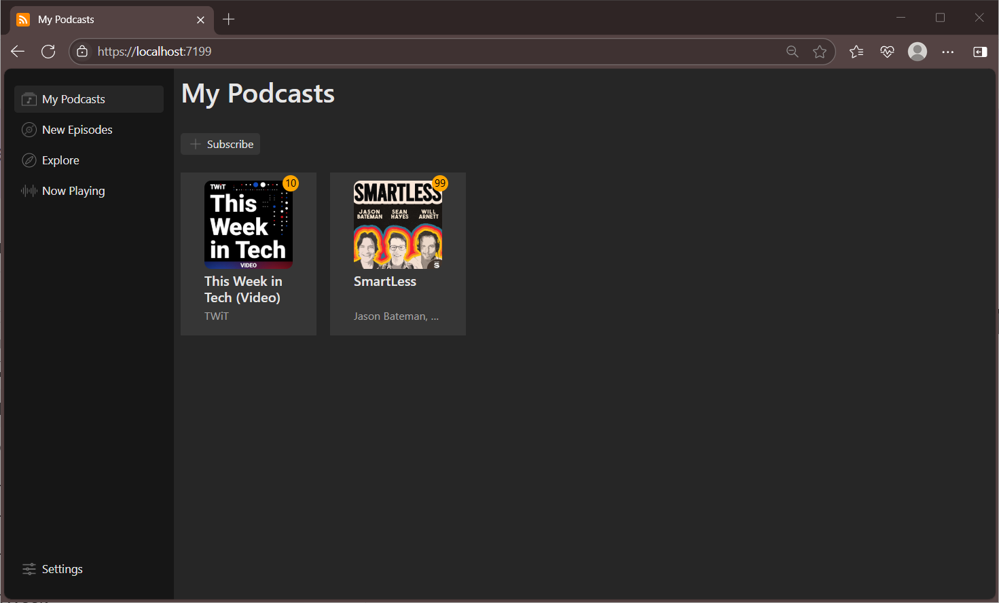
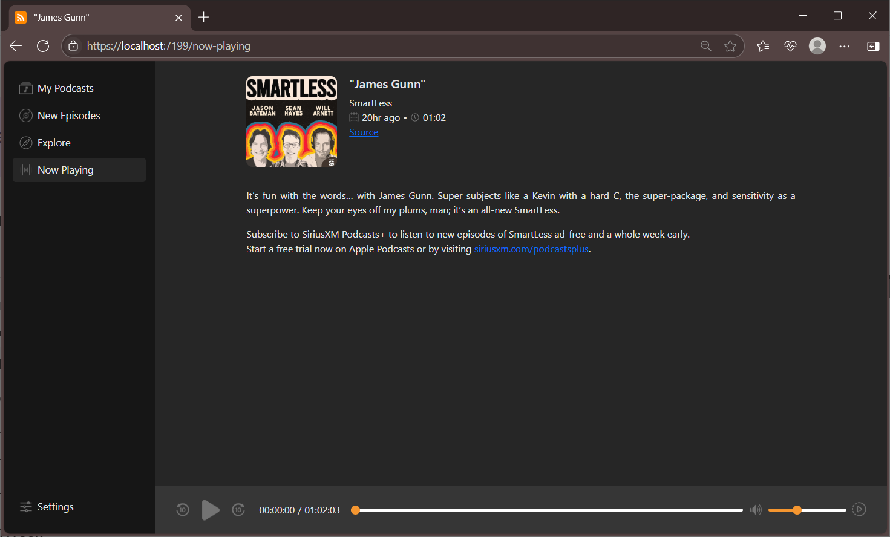
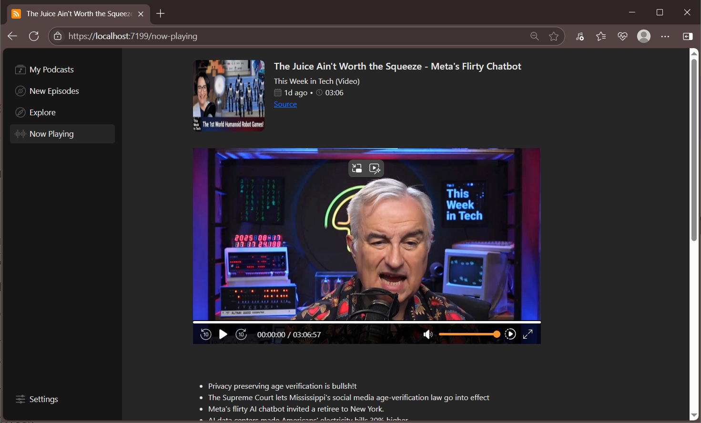

## About
Podcast Client is a web application for managing and consuming audio and video podcasts.

### Current Features
- Add podcasts via RSS feed
- Audio and video podcast support
- Multi-language interface (English, Russian)
- Dark/Light theme support
- Sort episodes by release date
- Filter episodes by views/play

### Planned Features
- Explore page
- User accounts and sync
- UI update and more

## Screenshots
### My Podcasts Dashboard

### Individual Podcast Page

### Audio Player

### Video Player
