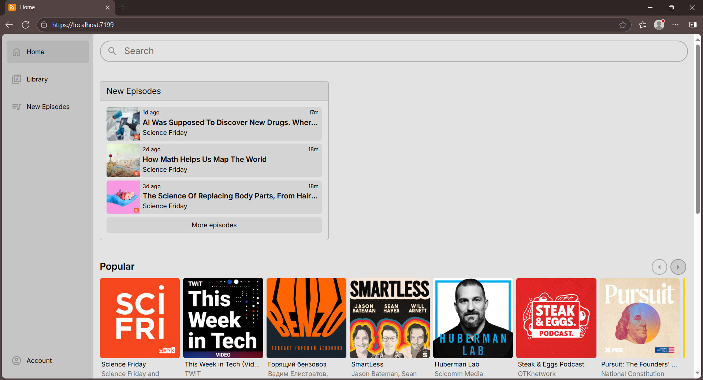
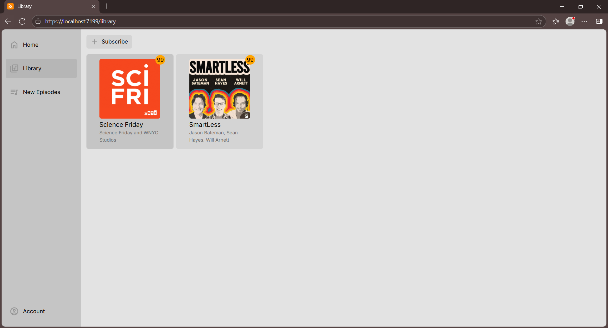
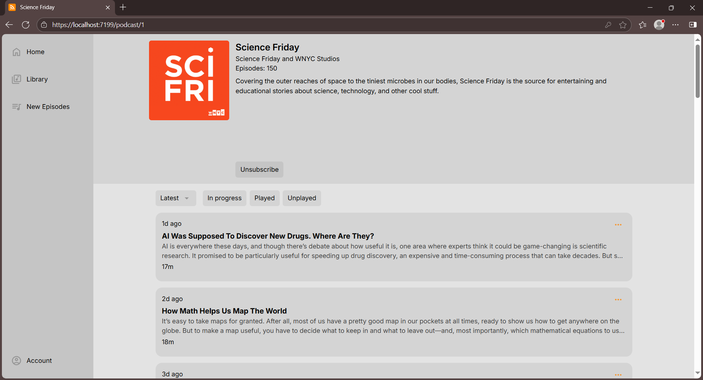
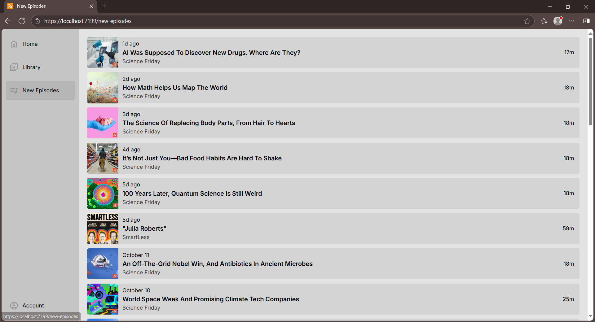
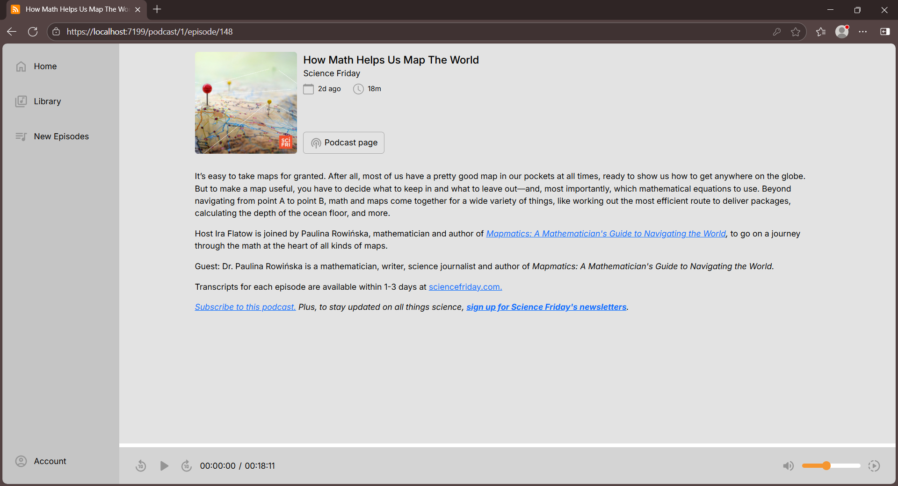
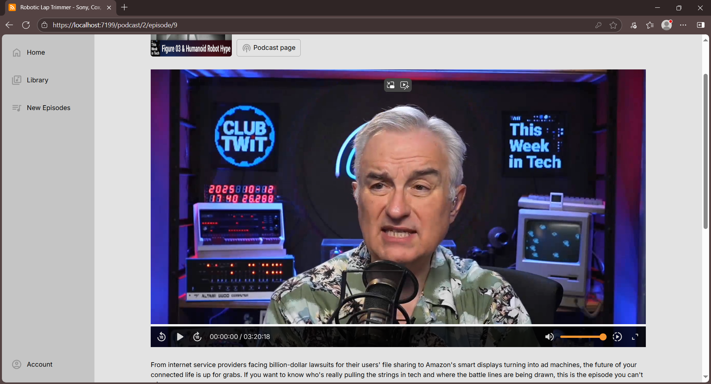

## About
Podcast Client is a web application for managing and consuming audio and video podcasts.

### Current Features
- Podcasts can be explored on the main page
- Add podcasts via RSS feed
- Audio and video podcast support
- Multi-language interface (English, Russian)
- Dark/Light theme support
- Sort episodes by release date
- Filter episodes by views/play

## Screenshots
### Home

### Library

### Individual Podcast Page

### New Episodes Page

### Audio episode page

### Video episode page
